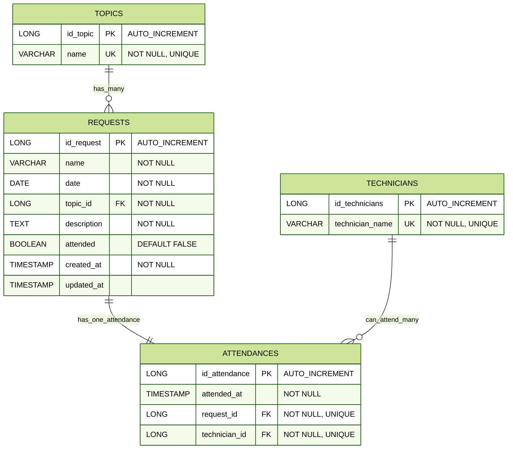
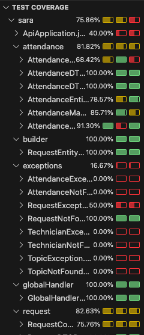

# Support App - Helpdesk Software
A startup has requested the construction of an API to be consumed by its web application and its mobile app. The API should be able to register employee requests for technical support from their IT department if needed. User identification through a security module will not be necessary.

## 🛠 Technologies
* Java 21 SE
* Spring & Spring Boot
* Spring Data JPA
* Database: H2

## 🎯 Diagrams 
### Class diagram

### Database schema


## 📑 Documentation with Swagger

## ⚙️ Execution
Follow these steps to get the project up and running:

1. Clone the Repository: Open your terminal and clone the project using the following command:
   ```
   git clone [https://github.com/sara-vazquez/api-employee]
   ```
2. Compile the Project: Use Maven to compile the source code.
   ```
   mvn clean install
   ```
3. Execute the application
   ```
   java -jar target/support-api-0.0.1-SNAPSHOT.jar
   ```


## 📯 Postman
[Postman collection link](https://lunar-rocket-4378638.postman.co/workspace/API-practice~317c143d-3828-4b04-8929-47a76e03adfa/collection/45994293-eca8c853-f45b-482e-a2b3-6d3d346eec15?action=share&creator=45994293)

## 🧪 Test Coverage

